# A tour of the dashboard

What a rig looks like once it has boards and a week of work behind it. Every
picture on this page is the real dashboard, taken of a demo rig: four boards
on a powered hub, three projects, a CI key and a person running suites. The
names, runs and boards are made up; [the recipe](#how-these-pictures-are-made)
is at the bottom, and anyone can take them again.

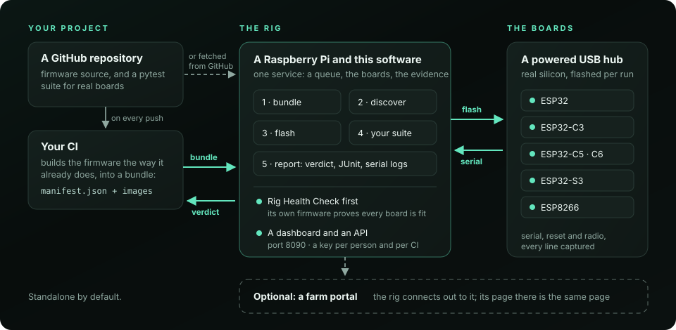

## Overview: the rig at a glance

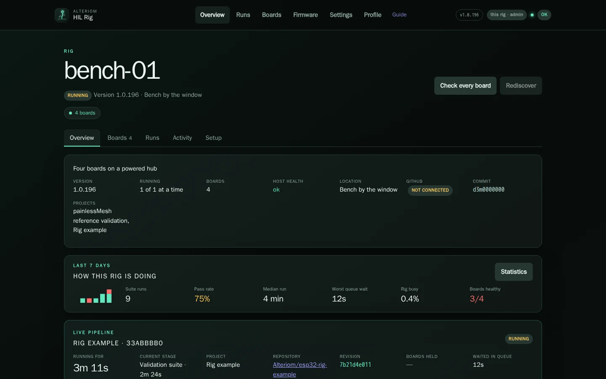

The rig's own page. Its name is the host's; the description and location are
yours, from **Settings → Rig**. Under them, the facts that answer "is this rig
fine": the version installed, how many runs it takes at a time, its boards,
the host's health, whether GitHub is connected and which projects it runs.

**How this rig is doing** is the last seven days in one line: suite runs per
day, the pass rate, the median run, the worst wait in the queue, how busy the
rig was and how many boards passed their last health check.
**Statistics** opens the whole picture. Below it, the run in progress, stage
by stage, as it happens.

## Runs: every run, newest first

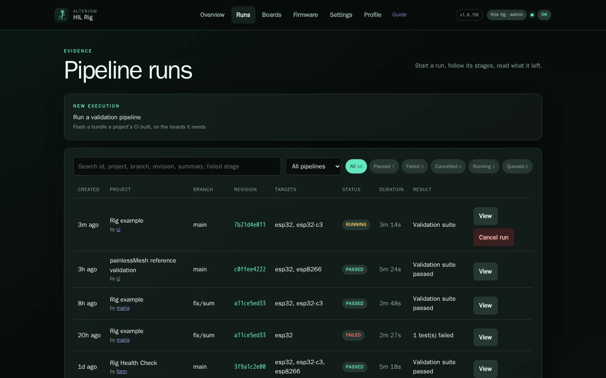

Every run the rig has made. Each row says what it was for, the branch and
commit, the boards' families, the verdict and how long it took, and **who
asked**: the key or account it came from. That name is a link to its
[profile](#profiles-who-asked-and-what-they-ran). Search by id, project,
branch, commit or failed stage; filter by status.

## A run: the pipeline and the evidence

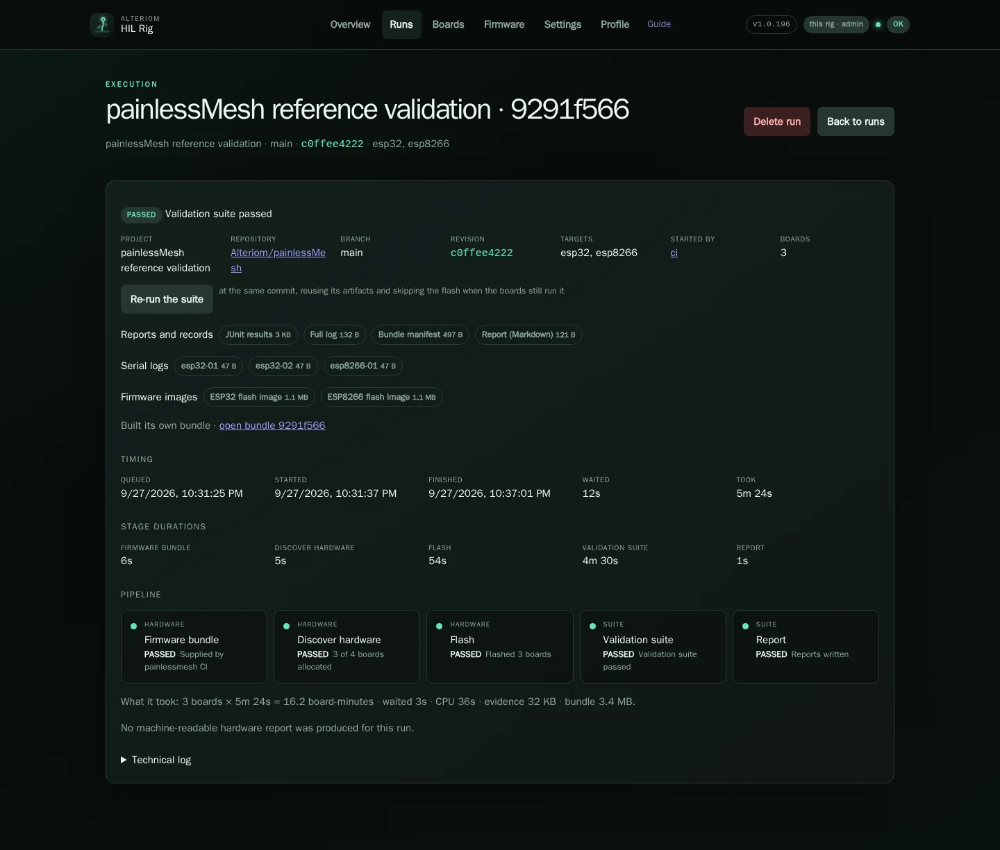

One run, start to finish. At the top, the verdict and the facts behind it:
project, repository, branch, commit, targets, who started it and how many
boards it held. Then the evidence, each file downloadable: JUnit results, the
full log, the bundle's manifest, the report, one serial capture per board and
the firmware images that were flashed. **Timing** and **Stage durations** say
where the minutes went; **What it took** is the run's meter: boards times
minutes, CPU, and the bytes it kept.

A failed run reads the same way, with the failing stage marked and its
failure text up front.

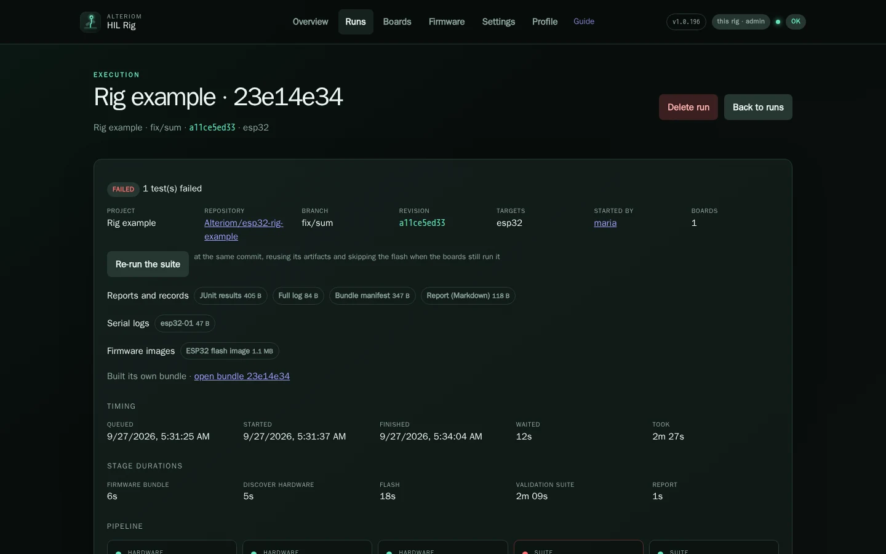

**Re-run the suite** runs it again at the same commit, reusing its bundle and
skipping the flash when the boards still run it.

## Boards: what is on the hub

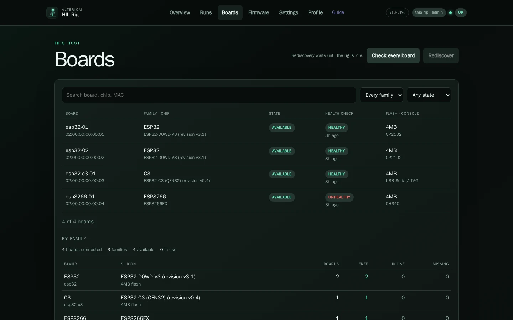

Every board the rig knows: its name and MAC, its family and the chip it
reported, whether it is free or held by a run, its last health check verdict
and when, and its flash and USB bridge. Here the ESP8266 failed its radio
check; it stays out of runs until a check passes again. **Check every board**
runs the Rig Health Check; **Rediscover** reads every port again once the rig
is idle. Below, the same boards by family.

## Firmware: the bundles the rig holds

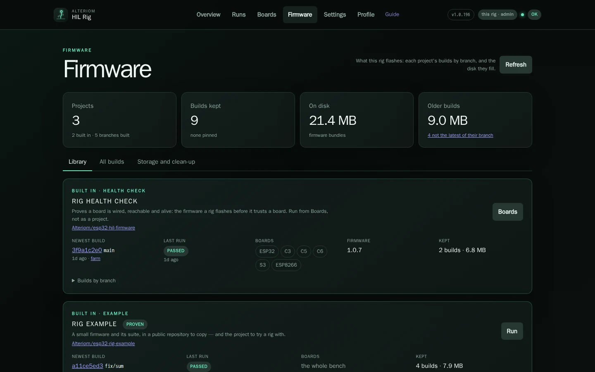

What the rig flashes, by project: the newest build of each branch and who it
came from, the last run on it, the families it holds, and how much it keeps
on disk. The health check's firmware arrives with each release. **All
builds** lists every bundle; **Storage and clean-up** says what a prune would
free and does it.

## Statistics: how the rig has been doing

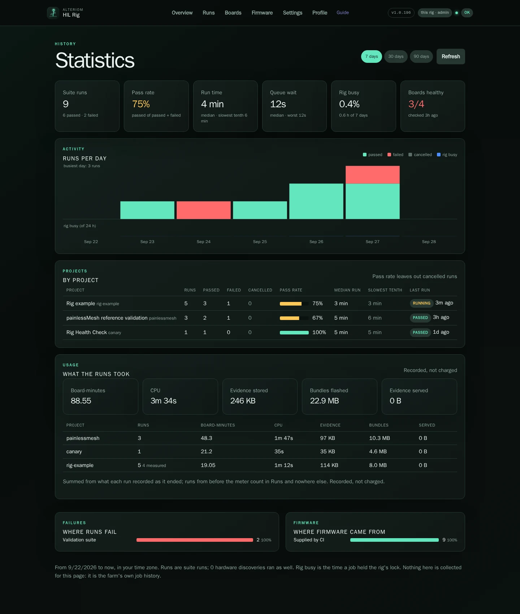

Seven, thirty or ninety days of the rig's history: runs per day by verdict,
each project's pass rate and run times, what the runs took in board-minutes,
CPU and storage, which stage failures come from and where the firmware came
from. It is computed from the rig's own job history; nothing is collected for
it.

## Profiles: who asked, and what they ran

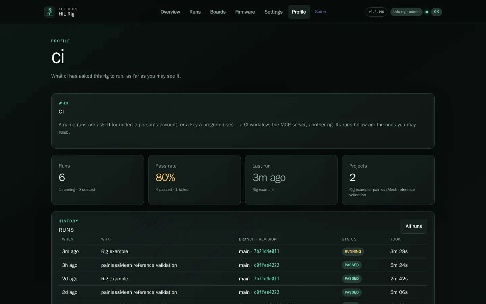

Every name a run was asked for under has a profile: a person's key, a CI's
key, a farm's account. It shows that name's runs as far as you may see them,
its pass rate, its last run and the projects it ran. Reach one from the
**by** link on any run.

**Profile** in the header is your own: who the rig says you are, your role
and what it lets you do, how you signed in, and your runs.

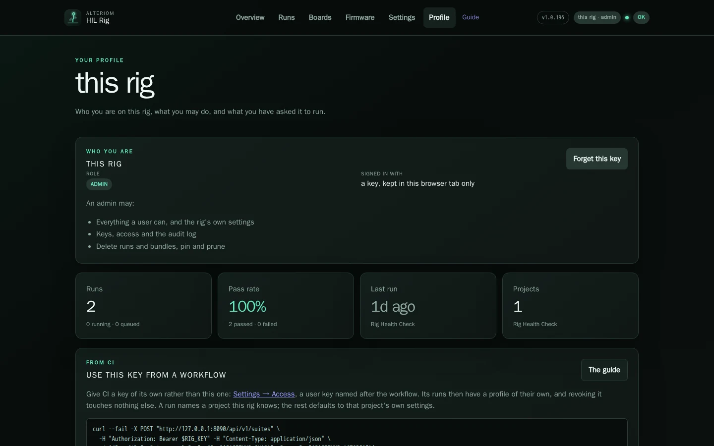

With a key, it also has **Use this key from a workflow**: the exact request a
CI job sends to run a suite, with this rig's address filled in. Give each CI
its own `user` key from **Settings → Access** rather than the rig's admin key:
its runs then have a profile of their own, and revoking it touches nothing
else. [Projects and your CI](projects.md) has the whole workflow.

## Settings

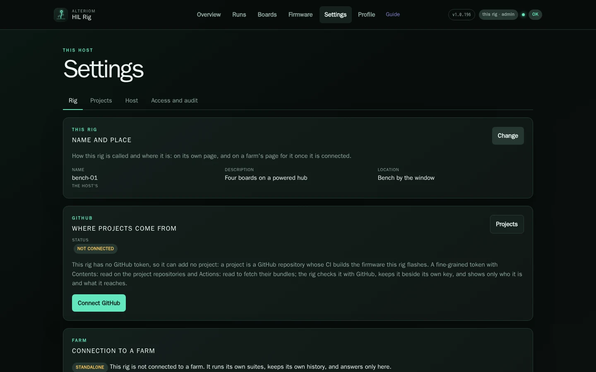

Four pages: **Rig** (its name and place, GitHub, a farm, the software),
**Projects**, **Host** and **Access and audit**. [The dashboard](dashboard.md#settings)
says what each setting does.

## On a phone

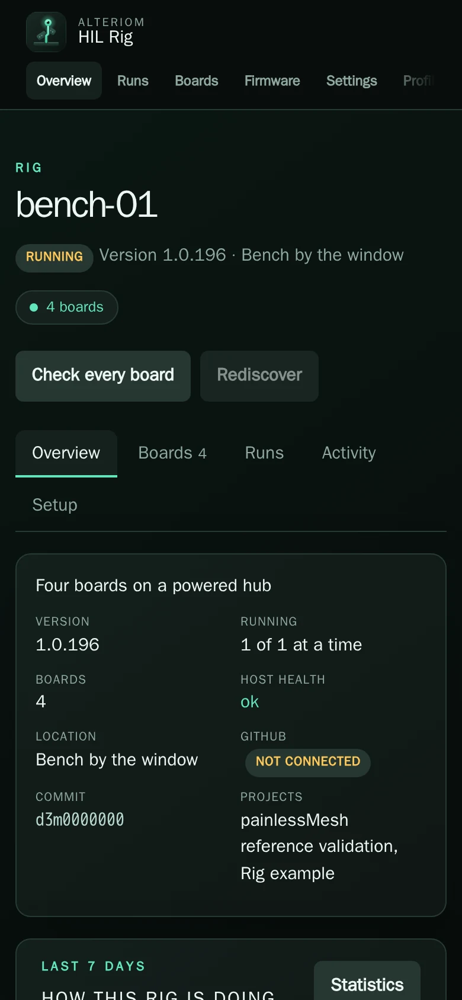{ width="300" }

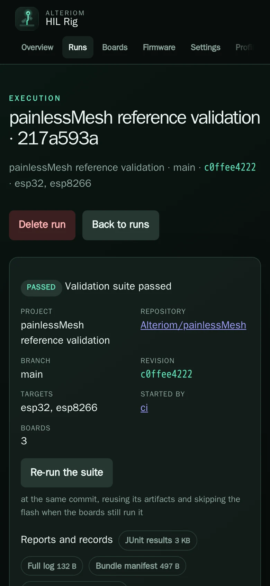{ width="300" }

The same pages at phone width: the menu scrolls sideways, facts stack in two
columns and a page's buttons move under its title.

## How these pictures are made

The pictures are taken by a script, of a demo rig, so they can be taken again
after any change to the dashboard. The demo is the real service on a state
directory written by `runner/screenshots/demo_rig.py`; nothing in it touches
hardware. `runner/screenshots/README.md` has the recipe.
