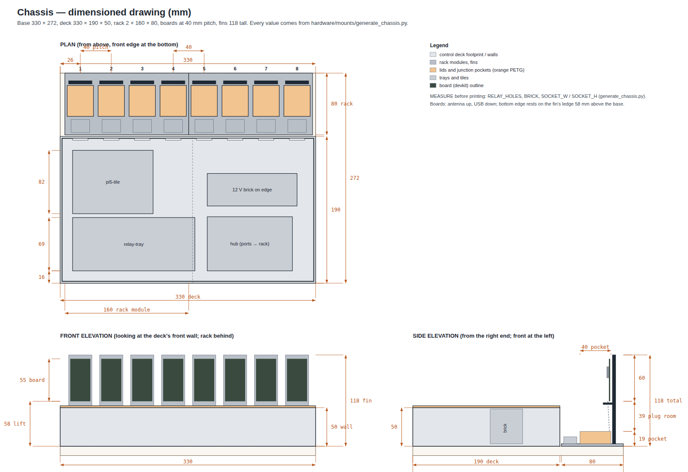

# Printable chassis

Everything that holds the rig together is generated, printable without
supports, and screws to a 330 × 272 mm base sheet (plywood, MDF, or
acrylic). Two scripts, pure Python, no dependencies:

| Script | Produces |
|--------|----------|
| [`generate_mounts.py`](generate_mounts.py) | the STL primitives plus `pi5-tile.stl` (Raspberry Pi 4/5, 58 × 49 hole pattern on 6 mm bosses, M2.5 screws self-tap) and `hub-strap-tile.stl` (USB hub on three zip-tie stations) |
| [`generate_chassis.py`](generate_chassis.py) | the control deck, trays and card rack described below |

STLs live in [`stl/`](stl/). Edit dimensions in the scripts and rerun
them — don't hand-edit the STLs. Holes are deliberately square: no
slicer circle-segmenting, no support, and screws and ties don't care. If
a screw hole prints tight, run the screw in once; these are self-forming
threads, not precision bores.

Why zip ties on the hub and the brick instead of screws: hubs and bricks
vary; a strap through a slot, along a groove recessed into the tile's
underside (so the tile still sits flat), and back up through the paired
slot holds any of them.

## Chassis

The relay-switched build in
[`docs/relay-power-wiring.md`](../../docs/relay-power-wiring.md) has a
relay module, a 12 V brick, sixteen red wires and a wire-nut junction per
board — the **chassis set** in [`generate_chassis.py`](generate_chassis.py)
encloses all of it. Boards stand **upright** in a card rack behind the
control deck (antenna up, USB socket down) and the brick stands **on its
edge**, so the whole eight-port rig is **330 × 272 mm** and no printed
part is longer than 178 mm (a 180 mm bed prints everything). Same rules as the tiles: pure Python, boxes only, no
supports, screw-to-base; run `python3 generate_chassis.py` after editing.

Renders: [deck lids off, pockets open](../renders/chassis-deck.png) ·
[card rack](../renders/chassis-rack.png) ·
[print set](../renders/chassis-printset.png)
(from [`render_chassis.py`](../renders/render_chassis.py)); the
dimensioned drawing is [`render_dimensions.py`](../renders/render_dimensions.py),
and `python3 ../renders/build_viewer.py` writes `chassis-viewer.html`, an
interactive assembly you can orbit. All three read their numbers from the
generator.

| STL | Qty | For |
|-----|-----|-----|
| `bay-corner-post` | 4 | 12 mm post, 50 mm tall; the two walls slide into 6 mm slots; screw foot inside the corner |
| `bay-splice-post` | 2 | in-line post at the deck midline joining the two segments of a side |
| `deck-wall-long` | 2 | 159 mm front segments with a 10 mm screw flange along the inside foot |
| `deck-wall-rear` | 2 | 159 mm rear segments, one 20 × 20 mm notch per board slot: hub cable + the two red wires |
| `deck-wall-end` | 2 | 178 mm end walls, two 32 × 22 mm cable entries each (Ethernet, Pi USB-C, 12 V barrel, hub PSU) |
| `deck-lid` | 2 | 165 × 190 mm vented halves; rails underneath drop inside the walls |
| `relay-tray` | 1 | 8-channel relay module on four slotted M3 bosses (±3 mm hole-pattern tolerance) |
| `pi5-tile`, `hub-strap-tile` | 1 each | from `generate_mounts.py` |
| `psu-cradle-side` | 1 | 12 V brick standing on its long edge (100 × 30 footprint, 48 mm tall under the 50 mm wall) |
| `rack-4slot` | 2 | four upright board slots at 40 mm pitch: a 118 mm fin per board with a 12 mm rib that sits between the header rows and two strap notches, a ledge under the board's bottom edge, the junction pocket beneath it, and the USB-C socket clamp facing the deck |
| `rack-pocket-lid` | 8 | pocket lid with a notch for the male pigtail rising to the board |

**Measure before printing.** Four constants at the top of
`generate_chassis.py` are defaults for the parts in the wiring doc and
must match what you received: `RELAY_HOLES` (module hole pattern),
`BRICK` (brick length, width, thickness), `SOCKET_W` / `SOCKET_H` (the
female pigtail's overmold). Everything else is derived.

### Printing

- Structure (posts, walls, trays, rack) in a dark PETG; lids and pocket
  lids in the accent colour — the renders use charcoal and orange. Same
  0.2 mm / 3 perimeters / 20 % as the tiles; walls and lids are 2.4 mm =
  6 perimeters, so they print solid.
- **Walls**: lie on the outer face, flange pointing up. **Lids**: plate on
  the bed, rails up. **Rack**: upright, fins are 4 mm thick. **Posts**:
  upright. Nothing needs supports; the longest part is 178 mm.
- Print one `rack-4slot` first and check the socket fits its clamp, a
  board sits on the ledge with its pins clear of the fin, and the wire
  nuts clear the pocket lid before printing the second.

### Layout on the 330 × 272 mm base

Plank, MDF, or an acrylic sheet; the deck walls sit 2.4 mm in from the
edge. Coordinates are the origin (front-left corner) of each part.

| x (mm) | y (mm) | Part |
|---|---|---|
| 0–330 | 0–190 | control deck |
| 16–174 | 16–85 | `relay-tray`, terminals toward the front wall |
| 190–300 | 16–86 | `hub-strap-tile`, **ports facing the rack** |
| 16–120 | 90–172 | `pi5-tile` |
| 190–306 | 100–142 | `psu-cradle-side` |
| 6–166 and 166–326 | 192–272 | `rack-4slot` × 2; slots at x = 26 + 40·n |

Board orientation: antenna up, USB socket down, components facing the
deck. The board's bottom edge rests on the fin's ledge 58 mm above the
base so the male pigtail's plug fits between the pocket lid and the
socket. Two cable ties go around board + fin at the notches; the rib
between the header rows keeps the pins off the fin. Devkits from 25 to
29 mm wide fit; ESP8266 NodeMCU (31 mm) needs the ties only.

**RF trade-off.** Eight parallel antennas at 40 mm pitch are far denser
than blueprint §6's 0.5 m. This is the layout for flash/OTA/serial/power
coverage and bench space; for mesh-timing results, reduce TX power in the
agent firmware (§7's first RF-containment candidate) and record the
pitch in the run summary, or leave alternate slots empty for an 80 mm
pitch when a run needs it.

### Assembly

1. Screw the posts down at the deck corners and midlines, slide the walls
   in (rear segments' notches line up with the rack slots), screw every
   flange (holes every 50 mm). Cable entries on the end walls face the
   mains side.
2. Deck: relay tray front-left, hub front-right with its ports toward the
   rear wall, Pi rear-left, brick cradle rear-right, per the layout
   table. Wire the relay per the wiring doc before the lids go on; the
   GPIO ribbon and the two 12 V wires stay inside the deck.
3. Rack modules behind the rear wall, screwed to the base. Per slot: clamp
   the female pigtail (strap over it), make the wire-nut joins in the
   pocket (§6 of the wiring doc), pass the hub cable and the two red
   wires forward through the slot's notch, fit the pocket lid, strap the
   board to the fin, plug the male pigtail in from below.
4. Deck lids on. Only the boards and their antennas stand above the rig;
   every wire is under a lid.

## Scaling

One chassis = one Pi, one hub, eight ports. Growing the farm is
additive: a second chassis with its own hub on the same Pi (blueprint §8
for the per-Pi ceiling), or a second Pi runner node.
