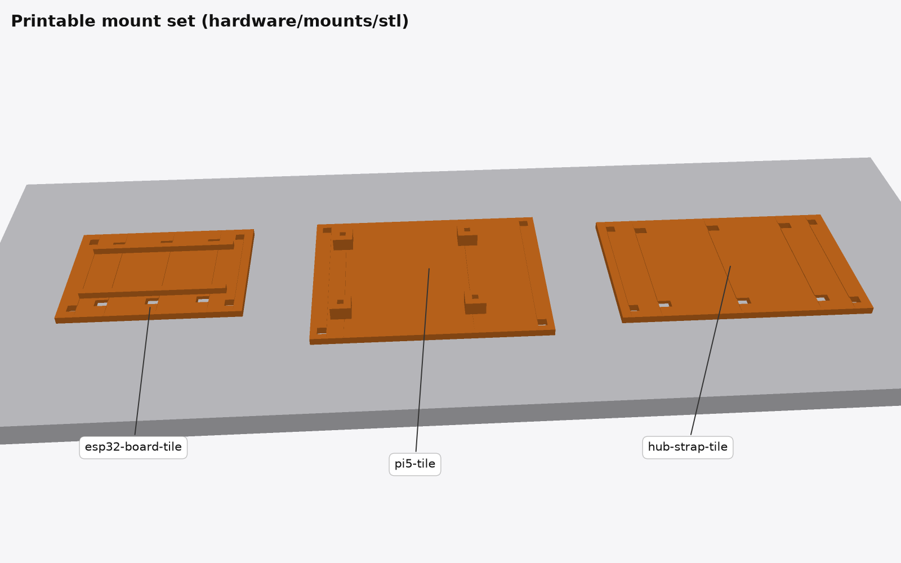
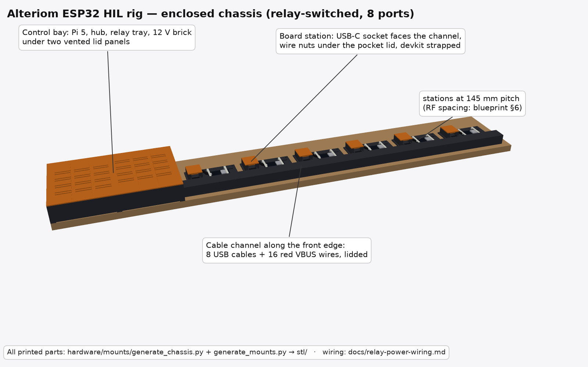

# Printable mounting plates

3D-printable tiles that turn any plank/pegboard into the rig described in
[`docs/hardware-blueprint.md`](../../docs/hardware-blueprint.md). The
tile-per-board approach is what makes the rig scalable: adding a board is
"print one tile, screw it to the plank at the pitch you want" — no
redesign of a monolithic plate, and RF spacing (blueprint §6) is a
placement choice, not a geometry constraint.

STLs live in [`stl/`](stl/); they are generated by
[`generate_mounts.py`](generate_mounts.py) (pure Python, no deps). Edit
dimensions there and rerun `python3 generate_mounts.py` — don't hand-edit
the STLs.

## The tiles

| STL | For | Mounting method |
|-----|-----|-----------------|
| `esp32-board-tile.stl` | one ESP32 devkit | 29 mm channel between rails locates the board; 2 of 3 zip-tie stations strap it down |
| `pi5-tile.stl` | Raspberry Pi 4/5 | 58×49 mm hole pattern on 6 mm standoff bosses, M2.5 screws self-tap |
| `hub-strap-tile.stl` | USB hub (later: relay boards, PSU bricks) | 3 zip-tie stations, no rails |

Why zip ties instead of screws for the ESP32s: devkit clones vary
(44–55 mm long, 25.4–28.5 mm wide) and many have **no mounting holes at
all**. The channel + tie combination holds any of them; the tie passes
down through a slot, runs in a groove recessed into the tile's underside
(so the tile still sits flat on the plank), and comes back up through the
paired slot.

## Printing

- **Material:** PETG preferred (rig runs 24/7 next to warm boards); PLA
  is fine in a cool room.
- **Settings:** 0.2 mm layers, 3 perimeters, 20 % infill, no supports —
  every face is flat-up from the bed.
- **Orientation:** as modelled (grooved face on the bed). First layer
  bridges nothing.
- **Plate time:** ~30–45 min per tile on a stock 0.4 mm nozzle.
- Holes are deliberately square: no slicer circle-segmenting, no support,
  and screws/ties don't care. If a screw hole prints tight, run the screw
  in once — these are self-forming threads, not precision bores.

## Assembly hardware (per tile)

- 4× #6 (M3.5) × 12 mm wood screws — tile → plank corner holes
- ESP32 tile: 2× standard 4.8 mm cable ties (any two of the three
  stations; use the pair closest to the board's ends)
- Pi tile: 4× M2.5 × 10 mm screws (self-tap into the bosses)
- Hub tile: 2–3× 4.8 mm cable ties

## Assembly

1. Print tiles: 1× Pi, 1× hub, N× board (print a spare board tile).
2. Screw the Pi and hub tiles at the plank's left end, board tiles at
   ≥0.5 m pitch (blueprint §4/§6). Tiles are numbered by position —
   label each `01`…`06` to match hub port and udev name.
3. Seat each ESP32 in its channel **antenna overhanging the tile edge**
   (keeps the PCB antenna off the plate), zip-tie at both ends over the
   board. Snug, not crushing — the tie bears on the module shield/pin
   headers, not on the antenna.
4. Route USB cables per blueprint §4; the tie stations double as cable
   strain relief if you loop the cable under a spare station.

## Scaling

One plank section = 1 Pi tile + 1 hub tile + 6 board tiles ("pod").
Growing the farm is additive: bolt another plank section alongside,
print another hub tile + 6 board tiles, add a hub. The Pi drives
multiple pods (see blueprint §8 for the per-Pi ceiling and when to add a
second Pi runner node instead).

## Chassis (enclosed rig)

The tiles above leave the rig open, which is fine for three boards and
one hub. The relay-switched build in
[`docs/relay-power-wiring.md`](../../docs/relay-power-wiring.md) adds a
relay module, a 12 V brick, sixteen red wires, and a wire-nut junction per
board — the **chassis set** in
[`generate_chassis.py`](generate_chassis.py) encloses the control end,
hides the wiring in a lidded channel, and gives every board a station
with its junction under a lid. Same rules: pure Python, boxes only, no
supports, screw-to-plank; run `python3 generate_chassis.py` after editing.

Renders: [control bay, lids off](../renders/chassis-control-bay.png) ·
[board station](../renders/chassis-station.png) ·
[print set](../renders/chassis-printset.png)
(from [`render_chassis.py`](../renders/render_chassis.py)).

| STL | Qty | For |
|-----|-----|-----|
| `bay-corner-post` | 4 | 12 mm post; the two walls slide into 6 mm slots; screw foot inside the corner |
| `bay-splice-post` | 2 | in-line post at the bay midline joining the two long segments of a side |
| `bay-wall-long` | 4 | 144 mm × 45 mm wall segment with a 10 mm screw flange along its inside foot |
| `bay-wall-short-outer` | 1 | 188 mm end wall (plank end) with two 32 × 22 mm cable entries: Ethernet, Pi USB-C, 12 V barrel, hub PSU |
| `bay-wall-short-inner` | 1 | 188 mm end wall with the 36 × 28 mm port the cable channel passes through |
| `bay-lid` | 2 | 150 × 200 mm vented half-lid; rails underneath drop inside the walls |
| `relay-tray` | 1 | 8-channel relay module on four slotted M3 bosses (±3 mm hole-pattern tolerance) |
| `psu-cradle` | 1 | 12 V brick between end stops, two straps |
| `cable-channel-200` / `-100` | 4 + 1 | 34 × 24 mm U-channel along the front edge, exit notches every 50 mm on the station side |
| `cable-channel-lid-200` / `-100` | 4 + 1 | press-fit lid |
| `board-station` | 1 per port | USB-C socket clamp (faces the channel) + wire-nut junction pocket + the 29 mm devkit channel and straps from `esp32-board-tile` |
| `station-pocket-lid` | 1 per port | friction-fit lid over the nuts |

**Measure before printing.** Four constants at the top of
`generate_chassis.py` are defaults for the parts in the wiring doc and
must match what you received: `RELAY_HOLES` (module hole pattern),
`BRICK` (brick footprint), `SOCKET_W` / `SOCKET_H` (the female pigtail's
overmold). Everything else is derived.

### Printing

- Structure (posts, walls, channel, trays, stations) in a dark PETG;
  lids and pocket lids in the accent colour — the renders use charcoal
  and orange. Same 0.2 mm / 3 perimeters / 20 % as the tiles; walls and
  lids are 2.4 mm = 6 perimeters, so they print solid.
- **Walls**: lie on the outer face, flange pointing up. **Lids**: plate on
  the bed, rails up. **Channel**: upright. **Posts**: upright. No part
  needs supports; the longest is 200 mm.
- Print one `board-station` first and check the socket fits its clamp
  and the wire nuts clear the pocket lid before printing the rest.

### Plank layout (1.2 m)

| x (mm) | y (mm) | Part |
|---|---|---|
| 0–300 | 0–200 | control bay (posts at the corners, walls 2.4 mm in from the plank edge) |
| 16–120 | 100–182 | `pi5-tile` |
| 16–126 | 22–92 | `hub-strap-tile` |
| 126–284 | 116–185 | `relay-tray` (terminal row toward the front) |
| 150–270 | 30–95 | `psu-cradle` |
| 280–1180 | 16–50 | cable channel: 4 × 200 + 1 × 100, starting inside the bay |
| 320 + 145·n | 60–130 | `board-station` n = 0…5 (six stations; ports 7–8 spare or a second plank) |

145 mm pitch is the compromise that fits six stations behind the bay on
one 1.2 m plank; the RF rules in blueprint §6 still prefer ≥0.5 m. Use a
longer plank or two planks if mesh-timing results look compressed.

### Assembly

1. Screw down the four corner posts and two splice posts at the bay
   corners and midlines, then slide the wall segments into their slots
   and screw every flange (holes every 50 mm). Cable entries on the outer
   end wall face the mains side; the channel port on the inner wall faces
   the plank.
2. Inside the bay: Pi tile rear-left, hub tile front-left, relay tray
   rear-right (terminals toward the front), PSU cradle front-right, per
   the layout table. Wire the relay per the wiring doc before the lids
   go on; the GPIO ribbon and the two 12 V wires stay inside the bay.
3. Screw the channel segments end to end along the front edge, starting
   inside the bay so the hub's cables drop straight in. Lids stay off
   until the last cable is routed.
4. One station per board: clamp the female pigtail (strap over it),
   make the wire-nut joins in the pocket (§6 of the wiring doc), run the
   two red wires and the unmodified hub cable into the channel through
   the nearest notch, fit the pocket lid, then strap the devkit on the
   rails with the antenna overhanging the far edge.
5. Channel lids on, bay lids on. Every wire is now under a lid; the only
   exposed cables are the short USB run from each notch to its socket and
   the male pigtail into each board.
